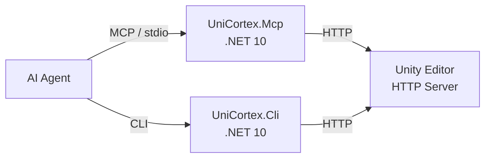

# UniCortex

> [!CAUTION]
> This project is still under active development. The API and command structure may change without notice.

A toolkit for controlling Unity Editor externally via REST API, MCP (Model Context Protocol), and CLI.

Primarily designed for AI agents (Claude Code, Codex CLI, etc.) to operate Unity Editor through MCP. Also provides a CLI tool for terminal-based control.

## Requirements

- Unity 2022.3 or later
- .NET 10 SDK (for MCP server and CLI)

## Installation

Add via Unity Package Manager using a Git URL:

1. Open Package Manager
2. Click the `+` button
3. Select "Add package from git URL"
4. Enter the following URL:

```
https://github.com/VeyronSakai/UniCortex.git
```

### MCP Server Setup

Add the following MCP server configuration to your MCP client's settings file (e.g., `.mcp.json`, `claude_desktop_config.json`, etc.). Refer to your client's documentation for the exact configuration location.

```json
{
  "mcpServers": {
    "Unity": {
      "type": "stdio",
      "command": "bash",
      "args": ["-c", "dotnet run --project ${UNICORTEX_PROJECT_PATH}/Library/PackageCache/com.veyron-sakai.uni-cortex@*/Tools~/UniCortex.Mcp/"],
      "env": {
        "UNICORTEX_PROJECT_PATH": "/path/to/your/unity/project"
      }
    }
  }
}
```

Replace `/path/to/your/unity/project` with the absolute path of your Unity project. After saving the configuration, restart the client to apply the changes.

The MCP server reads the port number from `Library/UniCortex/config.json` (written automatically when Unity Editor starts) and connects to the HTTP server.

No pre-build or tool installation is required. The MCP server is built and started automatically via `dotnet run`.

Alternatively, you can specify the URL directly via the `UNICORTEX_URL` environment variable (takes priority over `UNICORTEX_PROJECT_PATH`):

```json
{
  "mcpServers": {
    "Unity": {
      "type": "stdio",
      "command": "bash",
      "args": ["-c", "dotnet run --project ${UNICORTEX_PROJECT_PATH}/Library/PackageCache/com.veyron-sakai.uni-cortex@*/Tools~/UniCortex.Mcp/"],
      "env": {
        "UNICORTEX_PROJECT_PATH": "/path/to/your/unity/project",
        "UNICORTEX_URL": "http://localhost:12345"
      }
    }
  }
}
```

## CLI Usage

UniCortex also provides a CLI tool for controlling Unity Editor from the terminal. It talks to the same Unity-side HTTP server as the MCP server, so the Unity Editor must be open with the UniCortex package loaded.

### Connection settings

The CLI resolves the Unity Editor endpoint in the following order:

1. If `UNICORTEX_URL` is set, the CLI connects directly to that URL.
2. Otherwise, it uses `UNICORTEX_PROJECT_PATH` to read `Library/UniCortex/config.json`, which is written when the Unity Editor starts.
3. If neither is set, the CLI exits with an error.

### Run commands with `dotnet run --project`

```bash
export UNICORTEX_PROJECT_PATH="/path/to/your/unity/project"
export UNICORTEX_CLI_PROJECT=$(echo "${UNICORTEX_PROJECT_PATH}"/Library/PackageCache/com.veyron-sakai.uni-cortex@*/Tools~/UniCortex.Cli)

dotnet run --project "$UNICORTEX_CLI_PROJECT" -- editor ping
dotnet run --project "$UNICORTEX_CLI_PROJECT" -- scene hierarchy
dotnet run --project "$UNICORTEX_CLI_PROJECT" -- gameobject find "t:Camera"
dotnet run --project "$UNICORTEX_CLI_PROJECT" -- component properties 1234 UnityEngine.Transform
dotnet run --project "$UNICORTEX_CLI_PROJECT" -- test run --test-mode EditMode
```

### Install as a `dotnet` local tool

If you call the CLI frequently from the same repository or Unity project, you can pack it once and install it through a local tool manifest.

```bash
export UNICORTEX_PROJECT_PATH="/path/to/your/unity/project"
export UNICORTEX_CLI_PROJECT=$(echo "${UNICORTEX_PROJECT_PATH}"/Library/PackageCache/com.veyron-sakai.uni-cortex@*/Tools~/UniCortex.Cli)

mkdir -p ./.unicortex-tools/nupkg
dotnet pack "$UNICORTEX_CLI_PROJECT" -o ./.unicortex-tools/nupkg

# Run once in the directory where you want the tool manifest to live
dotnet new tool-manifest
dotnet tool install --local --add-source ./.unicortex-tools/nupkg UniCortex.Cli

dotnet tool run unicortex -- editor ping
dotnet tool run unicortex -- scene hierarchy
```

If the tool is already installed, repack and run `dotnet tool update --local --add-source ./.unicortex-tools/nupkg UniCortex.Cli` instead.

### Argument and output conventions

- Required parameters are positional arguments, for example `scene open Assets/Scenes/Main.unity`.
- Optional parameters with defaults become named options, for example `gameobject modify 1234 --name CameraRig --active-self true`.
- Read/query commands usually print JSON, such as `scene hierarchy`, `gameobject find`, `component properties`, and `recorder all list`.
- State-changing commands usually print a short status message, such as `editor play`, `scene open`, `component add`, and `timeline track bind`.
- `screenshot capture` writes a file to the path you pass, and recorder commands create media files in the configured output path.

### Command groups

| Group | Subcommands | Details |
|------|-------------|---------|
| `editor` | `ping`, `play`, `stop`, `status`, `pause`, `unpause`, `step`, `undo`, `redo`, `save`, `reload-domain` | Control Editor state, Play Mode, save/undo flow, and script recompilation. |
| `scene` | `create`, `open`, `hierarchy` | Create or open scenes, then inspect the current hierarchy as JSON. |
| `gameobject` | `find`, `create`, `delete`, `modify` | Search by Unity Search query, create empty objects, delete by `instanceId`, or rename/reparent/change tag, layer, or active state. |
| `component` | `add`, `remove`, `properties`, `set-property` | Work with fully-qualified component type names such as `UnityEngine.Transform` and serialized property paths such as `m_LocalPosition.x`. |
| `prefab` | `create`, `instantiate`, `open`, `close` | Save scene objects as prefabs, instantiate prefabs, or move into and out of Prefab Mode. |
| `test` | `run` | Run Unity Test Runner tests. Supports optional filters such as `--test-mode`. |
| `console` | `logs`, `clear` | Inspect or clear Unity Editor logs. |
| `asset` / `project-window` / `menu` | `refresh` / `select` / `execute` | Refresh the Asset Database, select and ping assets, or invoke Unity menu items by path. |
| `scene-view` / `game-view` | `focus` / `focus` | Switch the active Scene View or Game View window. |
| `game-view size` | `get`, `list`, `set` | Inspect available Game View resolutions and change the selected index. |
| `screenshot` | `capture` | Capture the current rendering output to an image file. Play Mode only. |
| `input` | `send-key`, `send-mouse` | Send Input System keyboard or mouse events. Requires `com.unity.inputsystem`; Play Mode only. |
| `recorder all` / `recorder movie` | `list` / `add`, `remove`, `start`, `stop` | Inspect and control Unity Recorder movie recorders. Requires `com.unity.recorder`. |
| `timeline` / `timeline track` / `timeline clip` | `create`, `play`, `stop` / `add`, `remove`, `bind` / `add`, `remove` | Create and edit Timeline assets and control playback. Requires `com.unity.timeline`. |
| `extension` | `list`, `execute` | Discover and invoke custom `ExtensionHandler` implementations from your Unity project. |

### Representative workflows

```bash
# Find cameras and inspect a component
dotnet run --project "$UNICORTEX_CLI_PROJECT" -- gameobject find "t:Camera"
dotnet run --project "$UNICORTEX_CLI_PROJECT" -- component properties 1234 UnityEngine.Transform

# Rename and reparent a GameObject
dotnet run --project "$UNICORTEX_CLI_PROJECT" -- gameobject modify 1234 --name CameraRig --parent-instance-id 5678

# Set a serialized property
dotnet run --project "$UNICORTEX_CLI_PROJECT" -- component set-property 1234 UnityEngine.Transform m_LocalPosition.x 1.5

# Capture a screenshot
dotnet run --project "$UNICORTEX_CLI_PROJECT" -- screenshot capture ./Artifacts/gameview.png

# Discover and run a custom extension
dotnet run --project "$UNICORTEX_CLI_PROJECT" -- extension list
dotnet run --project "$UNICORTEX_CLI_PROJECT" -- extension execute count_gameobjects --arguments '{"nameFilter":"Camera"}'
```

## Available MCP Tools

### Editor Control

| Tool | Description |
|------|-------------|
| `ping_editor` | Check connectivity with the Unity Editor |
| `enter_play_mode` | Start Play Mode |
| `exit_play_mode` | Stop Play Mode |
| `get_editor_status` | Get the current state of the Unity Editor (play mode, paused) |
| `pause_editor` | Pause the Unity Editor. Use with `step_editor` for frame-by-frame control |
| `unpause_editor` | Unpause the Unity Editor |
| `step_editor` | Advance the Unity Editor by one frame while paused |
| `reload_domain` | Request script recompilation (domain reload) |
| `undo` | Undo the last operation |
| `redo` | Redo an undone operation |
| `save` | Save the currently active stage (Scene, Prefab, Timeline, etc.) |
### Scene

| Tool | Description |
|------|-------------|
| `create_scene` | Create a new empty scene and save it at the specified asset path |
| `open_scene` | Open a scene by path |
| `get_hierarchy` | Get the GameObject hierarchy tree of the current scene or Prefab |

### GameObject

| Tool | Description |
|------|-------------|
| `find_game_objects` | Search GameObjects by name, tag, component type, instanceId, layer, path, or state |
| `create_game_object` | Create a new empty GameObject |
| `delete_game_object` | Delete a GameObject (supports Undo) |
| `modify_game_object` | Modify name, active state, tag, layer, or parent |

### Component

| Tool | Description |
|------|-------------|
| `add_component` | Add a component to a GameObject |
| `remove_component` | Remove a component from a GameObject |
| `get_component_properties` | Get serialized properties of a component |
| `set_component_property` | Set a serialized property on a component |

### Prefab

| Tool | Description |
|------|-------------|
| `create_prefab` | Save a scene GameObject as a Prefab asset |
| `instantiate_prefab` | Instantiate a Prefab into the scene |
| `open_prefab` | Open a Prefab asset in Prefab Mode for editing |
| `close_prefab` | Close Prefab Mode and return to the main stage |

### Asset

| Tool | Description |
|------|-------------|
| `refresh_asset_database` | Refresh the Unity Asset Database |

### Project Window

| Tool | Description |
|------|-------------|
| `select_project_window_asset` | Select an asset in the Project Window, focus the window, and ping it |

### Console

| Tool | Description |
|------|-------------|
| `get_console_logs` | Get console log entries from the Unity Editor |
| `clear_console_logs` | Clear all console logs |

### Test

| Tool | Description |
|------|-------------|
| `run_tests` | Run Unity Test Runner tests and return results |

### Menu Item

| Tool | Description |
|------|-------------|
| `execute_menu_item` | Execute a Unity Editor menu item by path |

### Screenshot

| Tool | Description |
|------|-------------|
| `capture_screenshot` | Capture a screenshot of the current Unity rendering output (Play Mode only) |

### View

| Tool | Description |
|------|-------------|
| `focus_scene_view` | Switch focus to the Scene View window |
| `focus_game_view` | Switch focus to the Game View window |
| `get_game_view_size` | Get the current Game View size (width and height in pixels) |
| `get_game_view_size_list` | Get the list of available Game View sizes (built-in and custom) |
| `set_game_view_size` | Set the Game View resolution by index from the size list |

### Recorder

| Tool | Description |
|------|-------------|
| `get_all_recorders` | Get the list of all configured recorders and their settings (requires com.unity.recorder) |
| `add_movie_recorder` | Add a Movie recorder to the list with name, output path, encoder, quality, audio capture (requires com.unity.recorder) |
| `remove_movie_recorder` | Remove a Movie recorder from the list by index (requires com.unity.recorder) |
| `start_movie_recorder` | Start recording with the specified Movie recorder (Play Mode only, requires com.unity.recorder) |
| `stop_movie_recorder` | Stop recording and save the video file (requires com.unity.recorder) |

### Input

| Tool | Description |
|------|-------------|
| `send_key_event` | Send a keyboard event via Input System in Play Mode (requires com.unity.inputsystem) |
| `send_mouse_event` | Send a mouse event via Input System in Play Mode (requires com.unity.inputsystem). Supports press, release, and move for drag simulation |

### Timeline

| Tool | Description |
|------|-------------|
| `create_timeline` | Create a new TimelineAsset (.playable file) at the specified asset path (requires com.unity.timeline) |
| `add_timeline_track` | Add a track to a TimelineAsset (requires com.unity.timeline) |
| `remove_timeline_track` | Remove a track from a TimelineAsset by index (requires com.unity.timeline) |
| `bind_timeline_track` | Set the binding of a Timeline track on a PlayableDirector (requires com.unity.timeline) |
| `add_timeline_clip` | Add a default clip to a Timeline track (requires com.unity.timeline) |
| `remove_timeline_clip` | Remove a clip from a Timeline track by index (requires com.unity.timeline) |
| `play_timeline` | Start playback of a Timeline on a PlayableDirector (requires com.unity.timeline) |
| `stop_timeline` | Stop playback of a Timeline on a PlayableDirector and reset to the beginning (requires com.unity.timeline) |

### Extensions

User-defined extensions in your Unity project are automatically discovered and exposed alongside the built-in tools. See [Extension](#extension) for details.

## Extension

You can define extensions in your Unity project by creating Editor-only C# classes that inherit from `ExtensionHandler`. They are automatically discovered via `TypeCache` and exposed as MCP tools and CLI commands.

```csharp
#if UNITY_EDITOR
using UniCortex.Editor.Handlers.Extension;
using UnityEngine;

public class CountGameObjects : ExtensionHandler
{
    public override string Name => "count_gameobjects";
    public override string Description => "Count GameObjects in the current scene.";
    public override bool ReadOnly => true;

    public override ExtensionSchema InputSchema => new ExtensionSchema(
        new ExtensionProperty("nameFilter", ExtensionPropertyType.String,
            "Only count GameObjects whose name contains this string.")
    );

    public override string Execute(string argumentsJson)
    {
        // Runs on the Unity main thread — safe to call Unity APIs
        var filter = "";
        if (!string.IsNullOrEmpty(argumentsJson))
        {
            var args = JsonUtility.FromJson<Args>(argumentsJson);
            if (!string.IsNullOrEmpty(args.nameFilter))
                filter = args.nameFilter;
        }

        var allObjects = Object.FindObjectsByType<GameObject>(FindObjectsSortMode.None);
        var count = 0;
        foreach (var obj in allObjects)
        {
            if (string.IsNullOrEmpty(filter) || obj.name.Contains(filter))
                count++;
        }

        return $"Found {count} GameObject(s).";
    }

    [System.Serializable]
    private class Args
    {
        public string nameFilter;
    }
}
#endif
```

### API Reference

| Class | Description |
|-------|-------------|
| `ExtensionHandler` | Abstract base class. Override `Name`, `Description`, `InputSchema`, and `Execute()` |
| `ExtensionSchema` | Defines the input parameter schema via `ExtensionProperty` array |
| `ExtensionProperty` | Defines a single parameter: name, type, description, and whether it is required |
| `ExtensionPropertyType` | Parameter types: `String`, `Number`, `Integer`, `Boolean` |

> [!NOTE]
> After adding or removing extensions, restart the MCP client (e.g., Claude Code) to refresh the tool list.

## Architecture



- **Unity Editor side**: C# `HttpListener` HTTP server embedded in the Editor
- **Shared Core**: `UniCortex.Core` — service layer and HTTP infrastructure shared by MCP and CLI
- **MCP Server**: `UniCortex.Mcp` — .NET 10 + [Model Context Protocol C# SDK](https://github.com/modelcontextprotocol/csharp-sdk)
- **CLI Tool**: `UniCortex.Cli` — .NET 10 + [ConsoleAppFramework](https://github.com/Cysharp/ConsoleAppFramework)
- **UPM Package**: `com.veyron-sakai.uni-cortex`

## Documentation

- [`Documentations~/SPEC.md`](Documentations~/SPEC.md) — Full API endpoint and MCP tool definitions

## Contributing

When developing this package locally:

```bash
# Build all projects
dotnet build Tools~/UniCortex.Core/
dotnet build Tools~/UniCortex.Mcp/
dotnet build Tools~/UniCortex.Cli/

# Run tests
UNICORTEX_PROJECT_PATH=$(pwd)/Samples~ dotnet test Tools~/UniCortex.Core.Test/

# Run MCP server
dotnet run --project Tools~/UniCortex.Mcp/

# Run CLI
dotnet run --project Tools~/UniCortex.Cli/ -- editor ping
```

## License

MIT License - [LICENSE.txt](LICENSE.txt)
