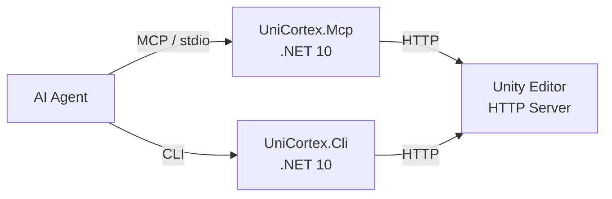

# UniCortex

> [!CAUTION]
> This project is still under active development. The API and command structure may change without notice.

A toolkit for controlling Unity Editor externally via REST API, MCP (Model Context Protocol), and CLI.

UniCortex can be used in two ways:

1. As an **MCP server** for AI agents such as Claude Code or Codex CLI
2. As a **CLI tool** for direct terminal-based control

In both cases, you must install the UniCortex Unity package into the target Unity project first.

## Requirements

- Unity 2022.3 or later
- .NET 10 SDK (for MCP server and CLI)

## Installation

Add via Unity Package Manager using a Git URL:

1. Open Package Manager
2. Click the `+` button
3. Select "Add package from git URL"
4. Enter the following URL:

```
https://github.com/VeyronSakai/UniCortex.git
```

## Use UniCortex as an MCP Server

Use this mode when you want an MCP client to call Unity operations as tools. The UniCortex Unity package must be installed in the target Unity project.

### MCP Server Setup

Add the following MCP server configuration to your MCP client's settings file (e.g., `.mcp.json`, `claude_desktop_config.json`, etc.). Refer to your client's documentation for the exact configuration location.

```json
{
  "mcpServers": {
    "Unity": {
      "type": "stdio",
      "command": "bash",
      "args": ["-c", "dotnet run --project ${UNICORTEX_PROJECT_PATH}/Library/PackageCache/com.veyron-sakai.uni-cortex@*/Tools~/UniCortex.Mcp/"],
      "env": {
        "UNICORTEX_PROJECT_PATH": "/path/to/your/unity/project"
      }
    }
  }
}
```

Replace `/path/to/your/unity/project` with the absolute path of your Unity project. After saving the configuration, restart the client to apply the changes.

The MCP server reads the port number from `Library/UniCortex/config.json` (written automatically when Unity Editor starts) and connects to the HTTP server.

No pre-build or tool installation is required. The MCP server is built and started automatically via `dotnet run`.

Alternatively, you can specify the URL directly via the `UNICORTEX_URL` environment variable (takes priority over `UNICORTEX_PROJECT_PATH`):

```json
{
  "mcpServers": {
    "Unity": {
      "type": "stdio",
      "command": "bash",
      "args": ["-c", "dotnet run --project ${UNICORTEX_PROJECT_PATH}/Library/PackageCache/com.veyron-sakai.uni-cortex@*/Tools~/UniCortex.Mcp/"],
      "env": {
        "UNICORTEX_PROJECT_PATH": "/path/to/your/unity/project",
        "UNICORTEX_URL": "http://localhost:12345"
      }
    }
  }
}
```

### Available MCP Tools

The MCP server exposes the following built-in tools.

#### Editor Control

| Tool | Description |
|------|-------------|
| `ping_editor` | Check connectivity with the Unity Editor |
| `enter_play_mode` | Start Play Mode |
| `exit_play_mode` | Stop Play Mode |
| `get_editor_status` | Get the current state of the Unity Editor (play mode, paused) |
| `pause_editor` | Pause the Unity Editor. Use with `step_editor` for frame-by-frame control |
| `unpause_editor` | Unpause the Unity Editor |
| `step_editor` | Advance the Unity Editor by one frame while paused |
| `reload_domain` | Request script recompilation (domain reload) |
| `undo` | Undo the last operation |
| `redo` | Redo an undone operation |
| `save` | Save the currently active stage (Scene, Prefab, Timeline, etc.) |
#### Scene

| Tool | Description |
|------|-------------|
| `create_scene` | Create a new empty scene and save it at the specified asset path |
| `open_scene` | Open a scene by path |
| `get_hierarchy` | Get the GameObject hierarchy tree of every loaded scene or the Prefab |

#### GameObject

| Tool | Description |
|------|-------------|
| `find_game_objects` | Search GameObjects in every loaded scene by name or component type, using the Hierarchy window's search syntax |
| `create_game_object` | Create a new empty GameObject, optionally under a parent at a given sibling index (with RectTransform support for UI) |
| `delete_game_object` | Delete a GameObject (supports Undo) |
| `modify_game_object` | Modify name, active state, tag, layer, parent, or sibling order |
| `duplicate_game_object` | Duplicate a GameObject including children and components (supports Undo) |

#### Component

| Tool | Description |
|------|-------------|
| `add_component` | Add a component to a GameObject |
| `remove_component` | Remove a component from a GameObject |
| `get_component_properties` | Get serialized properties of a component |
| `set_component_property` | Set a serialized property on a component |

Component type arguments are supplied as a fully-qualified type name plus the defining assembly name (e.g. `UnityEngine.Rigidbody` + `UnityEngine.PhysicsModule`).

Object reference properties (e.g. `PlayableDirector.m_PlayableAsset` or a `[SerializeField]` component field) accept an asset path (`Assets/Timelines/Intro.playable`), an asset GUID, an instanceId, or `null`. If the object does not match the field type, a matching component on the GameObject or a matching sub-asset in the same file is assigned instead, and an error is returned when nothing matches.

#### ScriptableObject

| Tool | Description |
|------|-------------|
| `create_scriptable_object` | Create a new ScriptableObject `.asset` file from a type name |
| `get_scriptable_object_properties` | Get serialized properties of an existing `.asset` file |
| `set_scriptable_object_property` | Set a serialized property on an existing `.asset` file |

`create_scriptable_object` takes the ScriptableObject subclass name plus the defining assembly name (e.g. `MyNamespace.MyData` + `Assembly-CSharp`). Property paths and value formats match `set_component_property`.

#### AnimationClip

| Tool | Description |
|------|-------------|
| `create_animation_clip` | Create a new empty AnimationClip `.anim` file (Loop Time and frame rate configurable) |
| `get_animation_curves` | Get the settings and all float curves (with keys) of an AnimationClip |
| `set_animation_curve` | Replace one float curve of an AnimationClip with the given keys (supports Undo) |
| `remove_animation_curve` | Remove one float curve from an AnimationClip (supports Undo) |

A curve is identified by `animatorRelativePath` (path relative to the Animator root, e.g. `Root/Child`), the component type plus its assembly name (e.g. `UnityEngine.UI.Image` + `UnityEngine.UI`), and `propertyName` (e.g. `m_Color.a`). Each key takes `time` / `value` and an optional `tangentMode` (`Free`, `Auto`, `ClampedAuto`, `Linear`, `Constant`).

#### Prefab

| Tool | Description |
|------|-------------|
| `create_prefab` | Save a scene GameObject as a Prefab asset |
| `instantiate_prefab` | Instantiate a Prefab into the scene |
| `open_prefab` | Open a Prefab asset in Prefab Mode for editing |
| `close_prefab` | Close Prefab Mode and return to the main stage |

#### Asset

| Tool | Description |
|------|-------------|
| `refresh_asset_database` | Refresh the Unity Asset Database |

#### Project Window

| Tool | Description |
|------|-------------|
| `select_project_window_asset` | Select an asset in the Project Window, focus the window, and ping it |

#### Console

| Tool | Description |
|------|-------------|
| `get_console_logs` | Get console log entries from the Unity Editor |
| `clear_console_logs` | Clear all console logs |

#### Test

| Tool | Description |
|------|-------------|
| `run_tests` | Run Unity Test Runner tests and return results |

#### Menu Item

| Tool | Description |
|------|-------------|
| `execute_menu_item` | Execute a Unity Editor menu item by path |

#### View

| Tool | Description |
|------|-------------|
| `focus_scene_view` | Switch focus to the Scene View window |
| `capture_scene_view` | Capture the Scene View as a PNG image. Works in both Edit Mode and Play Mode, and captures the Prefab contents in Prefab Mode (gizmos and Screen Space - Overlay UI are not included) |
| `focus_game_view` | Switch focus to the Game View window |
| `capture_game_view` | Capture the Game View as a PNG at the Game View resolution (Play Mode only) |
| `get_game_view_size` | Get the current Game View size (width and height in pixels) |
| `get_game_view_size_list` | Get the list of available Game View sizes (built-in and custom) |
| `set_game_view_size` | Set the Game View resolution by index from the size list |
| `get_game_view_scale` | Get the current Game View scale (zoom factor) and its valid range |
| `set_game_view_scale` | Set the Game View scale (zoom factor); clamped to the valid range |

#### Recorder

| Tool | Description |
|------|-------------|
| `get_all_recorders` | Get the list of all configured recorders and their settings (requires com.unity.recorder) |
| `add_movie_recorder` | Add a Movie recorder to the list with name, output path, encoder, quality, audio capture (requires com.unity.recorder) |
| `remove_movie_recorder` | Remove a Movie recorder from the list by index (requires com.unity.recorder) |
| `start_movie_recorder` | Start recording with the specified Movie recorder (Play Mode only, requires com.unity.recorder) |
| `stop_movie_recorder` | Stop recording and save the video file (requires com.unity.recorder) |

#### Input

| Tool | Description |
|------|-------------|
| `send_key_event` | Send a keyboard event via Input System in Play Mode (requires com.unity.inputsystem) |
| `click_pointer` | Click (or tap) at Game View coordinates via Input System in Play Mode (requires com.unity.inputsystem) |
| `drag_pointer` | Drag (or swipe) between Game View coordinates over frames in one call |
| `move_pointer` / `press_pointer` / `release_pointer` | Move the pointer, or press / release a button, at Game View coordinates for full control |
| `click_game_object` | Click (or tap) the center of a GameObject given by instanceId (currently uGUI elements only; requires com.unity.ugui) |
| `drag_game_object` | Drag (or swipe) between the centers of two GameObjects over frames in one call |
| `move_game_object` / `press_game_object` / `release_game_object` | Move the pointer, or press / release a button, at the center of a GameObject for full control |
| `get_pointer_targets` | List the uGUI objects that can be pressed now in Play Mode, with their rects in Game View coordinates (requires com.unity.ugui) |

#### Timeline

| Tool | Description |
|------|-------------|
| `create_timeline` | Create a new TimelineAsset (.playable file) at the specified asset path (requires com.unity.timeline) |
| `get_timeline_tracks` | Get an overview of the tracks and clips of a Timeline (types, timing, extrapolation, bindings, AnimationClips) by PlayableDirector or asset path (requires com.unity.timeline) |
| `get_timeline_track_properties` | Get the serialized properties of a Timeline track (requires com.unity.timeline) |
| `get_timeline_clip_properties` | Get the serialized properties of a clip's PlayableAsset (requires com.unity.timeline) |
| `add_timeline_track` | Add a track to a TimelineAsset (requires com.unity.timeline) |
| `remove_timeline_track` | Remove a track from a TimelineAsset by index (requires com.unity.timeline) |
| `bind_timeline_track` | Set the binding of a Timeline track on a PlayableDirector (requires com.unity.timeline) |
| `add_timeline_clip` | Add a default clip to a Timeline track (requires com.unity.timeline) |
| `remove_timeline_clip` | Remove a clip from a Timeline track by index (requires com.unity.timeline) |
| `modify_timeline_clip` | Change a clip's start, duration, timeScale, clipIn, ease in/out, and pre/post extrapolation (requires com.unity.timeline) |
| `set_timeline_clip_property` | Set a serialized property on a clip's PlayableAsset, e.g. its AnimationClip (`m_Clip`) or the settings of a custom clip (requires com.unity.timeline) |
| `set_timeline_track_property` | Set a serialized property on a track, e.g. Track Offsets or mute (requires com.unity.timeline) |
| `play_timeline` | Start playback of a Timeline on a PlayableDirector (requires com.unity.timeline) |
| `stop_timeline` | Stop playback of a Timeline on a PlayableDirector and reset to the beginning (requires com.unity.timeline) |
| `evaluate_timeline` | Evaluate a Timeline at the specified time without playing it, e.g. to inspect an intermediate state. Works in Edit Mode (including Prefab Mode) via the Timeline window preview (requires com.unity.timeline) |

#### Extensions

User-defined extensions in your Unity project are automatically discovered and exposed alongside the built-in tools. See [Extension](#extension) for details.

## Use UniCortex as a CLI Tool

Use this mode when you want to control Unity Editor directly from a terminal. As with the MCP server, the UniCortex Unity package must be installed in the target Unity project, and the Unity Editor must be open with the package loaded.

### Connection settings

The CLI resolves the Unity Editor endpoint in the following order:

1. If `UNICORTEX_URL` is set, the CLI connects directly to that URL.
2. Otherwise, it uses `UNICORTEX_PROJECT_PATH` to read `Library/UniCortex/config.json`, which is written when the Unity Editor starts.
3. If neither is set, the CLI exits with an error.

### Choose how to run the CLI

Choose one of the following options depending on how you want to invoke the CLI.

Whichever option you choose, make sure the CLI version matches the UniCortex package version installed in the Unity project. Running via `dotnet run --project` from `Library/PackageCache` naturally uses the same package version.

#### Option 1: Run commands with `dotnet run --project`

```bash
export UNICORTEX_PROJECT_PATH="/path/to/your/unity/project"
export UNICORTEX_CLI_PROJECT=$(echo "${UNICORTEX_PROJECT_PATH}"/Library/PackageCache/com.veyron-sakai.uni-cortex@*/Tools~/UniCortex.Cli)

dotnet run --project "$UNICORTEX_CLI_PROJECT" -- editor ping
dotnet run --project "$UNICORTEX_CLI_PROJECT" -- scene hierarchy
dotnet run --project "$UNICORTEX_CLI_PROJECT" -- game-object find "t:Camera"
dotnet run --project "$UNICORTEX_CLI_PROJECT" -- component property list 1234 UnityEngine.Transform UnityEngine.CoreModule
dotnet run --project "$UNICORTEX_CLI_PROJECT" -- test run --test-mode EditMode
```

#### Option 2: Install as a `dotnet` local tool

Install `UniCortex.Cli` from NuGet.org as a local tool.

```bash
dotnet new tool-manifest
dotnet tool install --local UniCortex.Cli

dotnet tool run unicortex -- editor ping
dotnet tool run unicortex -- scene hierarchy
```

If the tool is already installed, run `dotnet tool update --local UniCortex.Cli` instead.

If you share the tool manifest with your team, run `dotnet tool restore` before the first `dotnet tool run ...` so the manifest-defined tools are installed locally.

#### Option 3: Install as a `dotnet` global tool

Install `UniCortex.Cli` globally when you want to invoke `unicortex` directly from your shell.

```bash
dotnet tool install --global UniCortex.Cli

unicortex editor ping
unicortex scene hierarchy
```

If the tool is already installed, run `dotnet tool update --global UniCortex.Cli` instead.

### Argument and output conventions

- Required parameters are positional arguments, for example `scene open Assets/Scenes/Main.unity`.
- Optional parameters with defaults become named options, for example `game-object modify 1234 --name CameraRig --tag Player`.
- Boolean options are flags that take no value, for example `game-object modify 1234 --deactivate`.
- Read/query commands usually print JSON, such as `scene hierarchy`, `game-object find`, `component property list`, and `recorder all list`.
- State-changing commands usually print a short status message, such as `editor play`, `scene open`, `component add`, and `timeline track bind`.
- `game-view capture` and `scene-view capture` write a PNG file to the path you pass, and recorder commands create media files in the configured output path.

### Available CLI Commands

#### `editor`

| Command | Description |
| --- | --- |
| `editor ping` | Check connectivity with the Unity Editor. |
| `editor play` | Start Play Mode in the Unity Editor. |
| `editor stop` | Stop Play Mode in the Unity Editor. |
| `editor status` | Show the current play/paused state. |
| `editor pause` | Pause the Unity Editor. |
| `editor unpause` | Unpause the Unity Editor. |
| `editor step` | Advance the Unity Editor by one frame while paused. |
| `editor undo` | Perform Undo. |
| `editor redo` | Perform Redo. |
| `editor save` | Save the active stage. |
| `editor reload-domain` | Request script recompilation. |

#### `scene`

| Command | Description |
| --- | --- |
| `scene create` | Create a new empty scene at the specified asset path. |
| `scene open` | Open a scene by asset path. |
| `scene hierarchy` | Print the current scene hierarchy as JSON. |

#### `game-object`

| Command | Description |
| --- | --- |
| `game-object find` | Search GameObjects with the Hierarchy window's search syntax. |
| `game-object create` | Create a new empty GameObject, optionally under a parent at a given sibling index. |
| `game-object delete` | Delete a GameObject by `instanceId`. |
| `game-object modify` | Rename, reparent, reorder, or change active state, tag, or layer. |
| `game-object duplicate` | Duplicate a GameObject (deep copy of children and components). |

#### `component`

| Command | Description |
| --- | --- |
| `component add` | Add a component to a GameObject. |
| `component remove` | Remove a component from a GameObject. |
| `component property list` | Print serialized component properties as JSON. |
| `component property set` | Set a serialized property by path. |

Component commands accept the fully-qualified component type name plus the defining assembly name (e.g. `UnityEngine.Rigidbody UnityEngine.PhysicsModule`).

#### `scriptable-object`

| Command | Description |
| --- | --- |
| `scriptable-object create` | Create a new ScriptableObject `.asset` file at the specified path. |
| `scriptable-object property list` | Print serialized properties of an existing `.asset` file as JSON. |
| `scriptable-object property set` | Set a serialized property on an existing `.asset` file by path. |

`scriptable-object create` accepts the fully-qualified ScriptableObject subclass name plus the defining assembly name (e.g. `MyNamespace.MyData Assembly-CSharp`).

#### `animation-clip`

| Command | Description |
| --- | --- |
| `animation-clip create` | Create a new empty AnimationClip `.anim` file. Supports `--loop` and `--frame-rate`. |
| `animation-clip curve list` | Print the settings and all float curves of an AnimationClip as JSON. |
| `animation-clip curve set` | Replace one float curve with keys given as a JSON array. Use `--animator-relative-path` for the path relative to the Animator root. |
| `animation-clip curve remove` | Remove one float curve. |

#### `prefab`

| Command | Description |
| --- | --- |
| `prefab create` | Save a scene GameObject as a Prefab asset. |
| `prefab instantiate` | Instantiate a Prefab into the current scene. |
| `prefab open` | Open a Prefab in Prefab Mode. |
| `prefab close` | Close Prefab Mode and return to the main stage. |

#### `test`

| Command | Description |
| --- | --- |
| `test run` | Run Unity Test Runner tests. Supports filters such as `--test-mode`, `--test-names`, `--group-names`, `--category-names`, and `--assembly-names`. |

#### `console`

| Command | Description |
| --- | --- |
| `console logs` | Read Unity Editor console logs. Fetches every level by default; pass `--info`, `--warning`, and/or `--error` to fetch only those levels (e.g. `console logs --error`). Add `--stack-trace` to include stack traces. |
| `console clear` | Clear Unity Editor console logs. |

#### `asset`, `project-window`, `menu`

| Command | Description |
| --- | --- |
| `asset refresh` | Refresh the Unity Asset Database. |
| `project-window select` | Select and ping an asset in the Project Window. |
| `menu execute` | Execute a Unity menu item by path. |

#### `scene-view`, `game-view`, `game-view size`, `game-view scale`

| Command | Description |
| --- | --- |
| `scene-view focus` | Focus the Scene View window. |
| `scene-view capture` | Capture the Scene View as a PNG file. Works in Edit Mode and Play Mode, including Prefab Mode. |
| `game-view focus` | Focus the Game View window. |
| `game-view capture` | Capture the Game View as a PNG file at the Game View resolution. Play Mode only. |
| `game-view size get` | Show the current Game View size. |
| `game-view size list` | List available Game View sizes. |
| `game-view size set` | Set the Game View size by index. |
| `game-view scale get` | Show the current Game View scale and its valid range. |
| `game-view scale set` | Set the Game View scale (zoom factor). |

#### `input`

| Command | Description |
| --- | --- |
| `input send-key` | Send an Input System key event. Requires `com.unity.inputsystem`; Play Mode only. |
| `input pointer click` | Click (or tap) at `--x`/`--y`. Requires `com.unity.inputsystem`; Play Mode only. |
| `input pointer drag` | Drag from `--from-x`/`--from-y` to `--to-x`/`--to-y` over `--frames` frames in one call. |
| `input pointer move` / `input pointer press` / `input pointer release` | Move the pointer, or press / release a button, at `--x`/`--y` for full control. |
| `input game-object click` | Click (or tap) the center of a GameObject (`--instance-id`; currently uGUI elements only). Requires `com.unity.ugui`. |
| `input game-object drag` | Drag from `--from-instance-id` to `--to-instance-id` over `--frames` frames in one call. |
| `input game-object move` / `input game-object press` / `input game-object release` | Move the pointer, or press / release a button, at the center of a GameObject for full control. |
| `input pointer targets` | List the uGUI objects that can be pressed now. Requires `com.unity.ugui`; Play Mode only. |

#### `recorder all`, `recorder movie`

| Command | Description |
| --- | --- |
| `recorder all list` | List configured recorders. Requires `com.unity.recorder`. |
| `recorder movie add` | Add a Movie recorder. Requires `com.unity.recorder`. |
| `recorder movie remove` | Remove a Movie recorder by index. Requires `com.unity.recorder`. |
| `recorder movie start` | Start movie recording. Play Mode only; requires `com.unity.recorder`. |
| `recorder movie stop` | Stop movie recording and save the output file. |

#### `timeline`, `timeline track`, `timeline track property`, `timeline clip`, `timeline clip property`

| Command | Description |
| --- | --- |
| `timeline create` | Create a Timeline asset. Requires `com.unity.timeline`. |
| `timeline play` | Start Timeline playback on a PlayableDirector. Requires `com.unity.timeline`. |
| `timeline stop` | Stop Timeline playback and reset to the beginning. Requires `com.unity.timeline`. |
| `timeline evaluate` | Evaluate a Timeline at the specified time without playing it, e.g. to inspect an intermediate state. Works in Edit Mode (including Prefab Mode) via the Timeline window preview, so animated values are reverted when the preview ends. Requires `com.unity.timeline`. |
| `timeline track list` | Print the tracks and clips of a Timeline as JSON. Requires `com.unity.timeline`. |
| `timeline track add` | Add a Timeline track. Requires `com.unity.timeline`. |
| `timeline track remove` | Remove a Timeline track by index. Requires `com.unity.timeline`. |
| `timeline track bind` | Bind a Timeline track to a target object. Requires `com.unity.timeline`. |
| `timeline track property list` | Print the serialized properties of a Timeline track as JSON. Requires `com.unity.timeline`. |
| `timeline track property set` | Set a serialized property on a Timeline track. Requires `com.unity.timeline`. |
| `timeline clip add` | Add a clip to a Timeline track. Requires `com.unity.timeline`. |
| `timeline clip remove` | Remove a clip from a Timeline track. Requires `com.unity.timeline`. |
| `timeline clip modify` | Change the timing, ease, and extrapolation of a Timeline clip. Requires `com.unity.timeline`. |
| `timeline clip property list` | Print the serialized properties of a clip's PlayableAsset as JSON. Requires `com.unity.timeline`. |
| `timeline clip property set` | Set a serialized property on a clip's PlayableAsset. Requires `com.unity.timeline`. |

#### `extension`

| Command | Description |
| --- | --- |
| `extension list` | List registered extensions from the Unity project. |
| `extension execute` | Execute an extension by name, optionally passing JSON through `--arguments`. |

### Representative workflows

```bash
# Find cameras and inspect a component
dotnet run --project "$UNICORTEX_CLI_PROJECT" -- game-object find "t:Camera"
dotnet run --project "$UNICORTEX_CLI_PROJECT" -- component property list 1234 UnityEngine.Transform UnityEngine.CoreModule

# Rename and reparent a GameObject
dotnet run --project "$UNICORTEX_CLI_PROJECT" -- game-object modify 1234 --name CameraRig --parent-instance-id 5678

# Set a serialized property
dotnet run --project "$UNICORTEX_CLI_PROJECT" -- component property set 1234 UnityEngine.Transform UnityEngine.CoreModule m_LocalPosition.x 1.5

# Create and edit a ScriptableObject .asset
dotnet run --project "$UNICORTEX_CLI_PROJECT" -- scriptable-object create MyNamespace.MyData Assembly-CSharp Assets/Data/MyData.asset
dotnet run --project "$UNICORTEX_CLI_PROJECT" -- scriptable-object property set Assets/Data/MyData.asset m_Speed 1.5

# Create an AnimationClip and key an Image fade-in
dotnet run --project "$UNICORTEX_CLI_PROJECT" -- animation-clip create Assets/Animations/FadeIn.anim
dotnet run --project "$UNICORTEX_CLI_PROJECT" -- animation-clip curve set Assets/Animations/FadeIn.anim UnityEngine.UI.Image UnityEngine.UI m_Color.a '[{"time":0,"value":0},{"time":0.5,"value":1}]' --animator-relative-path Root/Child

# Capture the Scene View (Edit Mode) and the Game View (Play Mode)
dotnet run --project "$UNICORTEX_CLI_PROJECT" -- scene-view capture ./Artifacts/sceneview.png
dotnet run --project "$UNICORTEX_CLI_PROJECT" -- game-view capture ./Artifacts/gameview.png

# Discover and run a custom extension
dotnet run --project "$UNICORTEX_CLI_PROJECT" -- extension list
dotnet run --project "$UNICORTEX_CLI_PROJECT" -- extension execute count_gameobjects --arguments '{"nameFilter":"Camera"}'
```

## Extension

You can define extensions in your Unity project by creating Editor-only C# classes that inherit from `ExtensionHandler`. They are automatically discovered via `TypeCache` and exposed as MCP tools and CLI commands.

```csharp
#if UNITY_EDITOR
using UniCortex.Editor.Handlers.Extension;
using UnityEngine;

public class CountGameObjects : ExtensionHandler
{
    public override string Name => "count_gameobjects";
    public override string Description => "Count GameObjects in the current scene.";
    public override bool ReadOnly => true;

    public override ExtensionSchema InputSchema => new ExtensionSchema(
        new ExtensionProperty("nameFilter", ExtensionPropertyType.String,
            "Only count GameObjects whose name contains this string.")
    );

    public override string Execute(string argumentsJson)
    {
        // Runs on the Unity main thread — safe to call Unity APIs
        var filter = "";
        if (!string.IsNullOrEmpty(argumentsJson))
        {
            var args = JsonUtility.FromJson<Args>(argumentsJson);
            if (!string.IsNullOrEmpty(args.nameFilter))
                filter = args.nameFilter;
        }

        var allObjects = Object.FindObjectsByType<GameObject>(FindObjectsSortMode.None);
        var count = 0;
        foreach (var obj in allObjects)
        {
            if (string.IsNullOrEmpty(filter) || obj.name.Contains(filter))
                count++;
        }

        return $"Found {count} GameObject(s).";
    }

    [System.Serializable]
    private class Args
    {
        public string nameFilter;
    }
}
#endif
```

### API Reference

| Class | Description |
|-------|-------------|
| `ExtensionHandler` | Abstract base class. Override `Name`, `Description`, `InputSchema`, and `Execute()` |
| `ExtensionSchema` | Defines the input parameter schema via `ExtensionProperty` array |
| `ExtensionProperty` | Defines a single parameter: name, type, description, and whether it is required |
| `ExtensionPropertyType` | Parameter types: `String`, `Number`, `Integer`, `Boolean` |

> [!NOTE]
> After adding or removing extensions, restart the MCP client (e.g., Claude Code) to refresh the tool list.

## Architecture


```mermaid
graph LR
    Agent["AI Agent"]
    MCP["UniCortex.Mcp<br/>.NET 10"]
    CLI["UniCortex.Cli<br/>.NET 10"]
    Unity["Unity Editor<br/>HTTP Server"]

    Agent -- "MCP / stdio" --> MCP
    Agent -- "CLI" --> CLI
    MCP -- "HTTP" --> Unity
    CLI -- "HTTP" --> Unity
```

- **Unity Editor side**: C# `HttpListener` HTTP server embedded in the Editor
- **Shared Core**: `UniCortex.Core` — service layer and HTTP infrastructure shared by MCP and CLI
- **MCP Server**: `UniCortex.Mcp` — .NET 10 + [Model Context Protocol C# SDK](https://github.com/modelcontextprotocol/csharp-sdk)
- **CLI Tool**: `UniCortex.Cli` — .NET 10 + [ConsoleAppFramework](https://github.com/Cysharp/ConsoleAppFramework)
- **UPM Package**: `com.veyron-sakai.uni-cortex`

## Documentation

- [`Documentations~/SPEC.md`](Documentations~/SPEC.md) — Full API endpoint and MCP tool definitions

## Development

- Do not edit `README.md` directly. Make README documentation changes in `.github/DRAFT_README.md` instead.

When developing this package locally:

```bash
# Build all projects
dotnet build Tools~/UniCortex.Core/
dotnet build Tools~/UniCortex.Mcp/
dotnet build Tools~/UniCortex.Cli/

# Run tests
UNICORTEX_PROJECT_PATH=$(pwd)/Samples~ dotnet test Tools~/UniCortex.Core.Test/

# Run MCP server
dotnet run --project Tools~/UniCortex.Mcp/

# Run CLI
dotnet run --project Tools~/UniCortex.Cli/ -- editor ping
```

## License

MIT License - [LICENSE.txt](LICENSE.txt)
