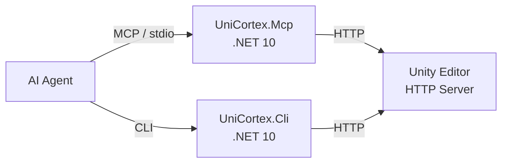

# UniCortex

> [!CAUTION]
> This project is still under active development. The API and command structure may change without notice.

A toolkit for controlling Unity Editor externally via REST API, MCP (Model Context Protocol), and CLI.

Primarily designed for AI agents (Claude Code, Codex CLI, etc.) to operate Unity Editor through MCP. Also provides a CLI tool for terminal-based control.

## Requirements

- Unity 2022.3 or later
- .NET 10 SDK (for MCP server and CLI)

## Installation

Add via Unity Package Manager using a Git URL:

1. Open Package Manager
2. Click the `+` button
3. Select "Add package from git URL"
4. Enter the following URL:

```
https://github.com/VeyronSakai/UniCortex.git
```

### MCP Server Setup

Add the following MCP server configuration to your MCP client's settings file (e.g., `.mcp.json`, `claude_desktop_config.json`, etc.). Refer to your client's documentation for the exact configuration location.

```json
{
  "mcpServers": {
    "Unity": {
      "type": "stdio",
      "command": "bash",
      "args": ["-c", "dotnet run --project ${UNICORTEX_PROJECT_PATH}/Library/PackageCache/com.veyron-sakai.uni-cortex@*/Tools~/UniCortex.Mcp/"],
      "env": {
        "UNICORTEX_PROJECT_PATH": "/path/to/your/unity/project"
      }
    }
  }
}
```

Replace `/path/to/your/unity/project` with the absolute path of your Unity project. After saving the configuration, restart the client to apply the changes.

The MCP server reads the port number from `Library/UniCortex/config.json` (written automatically when Unity Editor starts) and connects to the HTTP server.

No pre-build or tool installation is required. The MCP server is built and started automatically via `dotnet run`.

Alternatively, you can specify the URL directly via the `UNICORTEX_URL` environment variable (takes priority over `UNICORTEX_PROJECT_PATH`):

```json
{
  "mcpServers": {
    "Unity": {
      "type": "stdio",
      "command": "bash",
      "args": ["-c", "dotnet run --project ${UNICORTEX_PROJECT_PATH}/Library/PackageCache/com.veyron-sakai.uni-cortex@*/Tools~/UniCortex.Mcp/"],
      "env": {
        "UNICORTEX_PROJECT_PATH": "/path/to/your/unity/project",
        "UNICORTEX_URL": "http://localhost:12345"
      }
    }
  }
}
```

## CLI Usage

UniCortex also provides a CLI tool for controlling Unity Editor from the terminal:

```bash
# Set the Unity project path
export UNICORTEX_PROJECT_PATH="/path/to/your/unity/project"

# Run CLI commands
dotnet run --project "${UNICORTEX_PROJECT_PATH}/Library/PackageCache/com.veyron-sakai.uni-cortex@*/Tools~/UniCortex.Cli/" -- editor ping
dotnet run --project "${UNICORTEX_PROJECT_PATH}/Library/PackageCache/com.veyron-sakai.uni-cortex@*/Tools~/UniCortex.Cli/" -- scene hierarchy
dotnet run --project "${UNICORTEX_PROJECT_PATH}/Library/PackageCache/com.veyron-sakai.uni-cortex@*/Tools~/UniCortex.Cli/" -- gameobject find "t:Camera"
```

### CLI Commands

| Command | Description |
|---------|-------------|
| `editor ping\|play\|stop\|status\|pause\|unpause\|step\|undo\|redo\|save\|reload-domain` | Editor control |
| `scene create\|open\|hierarchy` | Scene operations |
| `gameobject find\|create\|delete\|modify` | GameObject operations |
| `component add\|remove\|properties\|set-property` | Component operations |
| `prefab create\|instantiate\|open\|close` | Prefab operations |
| `test run` | Run Unity tests |
| `console logs\|clear` | Console log management |
| `asset refresh` | Refresh Asset Database |
| `project-view select` | Select and ping an asset in Project View |
| `menu execute` | Execute menu items |
| `screenshot capture` | Capture screenshot (Play Mode only) |
| `scene-view focus` | Switch focus to Scene View |
| `game-view focus` | Switch focus to Game View |
| `game-view size get\|list\|set` | Game View size control |
| `recorder all list` | List all configured recorders (requires com.unity.recorder) |
| `recorder movie add\|remove\|start\|stop` | Movie Recorder management (requires com.unity.recorder) |
| `input send-key\|send-mouse` | Simulate input via Input System in Play Mode |
| `timeline create\|play\|stop` | Create a TimelineAsset / Play or Stop a Timeline |
| `timeline track add\|remove\|bind` | Timeline track operations |
| `timeline clip add\|remove` | Timeline clip operations |

## Available MCP Tools

### Editor Control

| Tool | Description |
|------|-------------|
| `ping_editor` | Check connectivity with the Unity Editor |
| `enter_play_mode` | Start Play Mode |
| `exit_play_mode` | Stop Play Mode |
| `get_editor_status` | Get the current state of the Unity Editor (play mode, paused) |
| `pause_editor` | Pause the Unity Editor. Use with `step_editor` for frame-by-frame control |
| `unpause_editor` | Unpause the Unity Editor |
| `step_editor` | Advance the Unity Editor by one frame while paused |
| `reload_domain` | Request script recompilation (domain reload) |
| `undo` | Undo the last operation |
| `redo` | Redo an undone operation |
| `save` | Save the currently active stage (Scene, Prefab, Timeline, etc.) |
### Scene

| Tool | Description |
|------|-------------|
| `create_scene` | Create a new empty scene and save it at the specified asset path |
| `open_scene` | Open a scene by path |
| `get_hierarchy` | Get the GameObject hierarchy tree of the current scene or Prefab |

### GameObject

| Tool | Description |
|------|-------------|
| `find_game_objects` | Search GameObjects by name, tag, component type, instanceId, layer, path, or state |
| `create_game_object` | Create a new empty GameObject |
| `delete_game_object` | Delete a GameObject (supports Undo) |
| `modify_game_object` | Modify name, active state, tag, layer, or parent |

### Component

| Tool | Description |
|------|-------------|
| `add_component` | Add a component to a GameObject |
| `remove_component` | Remove a component from a GameObject |
| `get_component_properties` | Get serialized properties of a component |
| `set_component_property` | Set a serialized property on a component |

### Prefab

| Tool | Description |
|------|-------------|
| `create_prefab` | Save a scene GameObject as a Prefab asset |
| `instantiate_prefab` | Instantiate a Prefab into the scene |
| `open_prefab` | Open a Prefab asset in Prefab Mode for editing |
| `close_prefab` | Close Prefab Mode and return to the main stage |

### Asset

| Tool | Description |
|------|-------------|
| `refresh_asset_database` | Refresh the Unity Asset Database |

### Project View

| Tool | Description |
|------|-------------|
| `select_project_view_asset` | Select an asset in the Project View, focus the window, and ping it |

### Console

| Tool | Description |
|------|-------------|
| `get_console_logs` | Get console log entries from the Unity Editor |
| `clear_console_logs` | Clear all console logs |

### Test

| Tool | Description |
|------|-------------|
| `run_tests` | Run Unity Test Runner tests and return results |

### Menu Item

| Tool | Description |
|------|-------------|
| `execute_menu_item` | Execute a Unity Editor menu item by path |

### Screenshot

| Tool | Description |
|------|-------------|
| `capture_screenshot` | Capture a screenshot of the current Unity rendering output (Play Mode only) |

### View

| Tool | Description |
|------|-------------|
| `focus_scene_view` | Switch focus to the Scene View window |
| `focus_game_view` | Switch focus to the Game View window |
| `get_game_view_size` | Get the current Game View size (width and height in pixels) |
| `get_game_view_size_list` | Get the list of available Game View sizes (built-in and custom) |
| `set_game_view_size` | Set the Game View resolution by index from the size list |

### Recorder

| Tool | Description |
|------|-------------|
| `get_all_recorders` | Get the list of all configured recorders and their settings (requires com.unity.recorder) |
| `add_movie_recorder` | Add a Movie recorder to the list with name, output path, encoder, quality, audio capture (requires com.unity.recorder) |
| `remove_movie_recorder` | Remove a Movie recorder from the list by index (requires com.unity.recorder) |
| `start_movie_recorder` | Start recording with the specified Movie recorder (Play Mode only, requires com.unity.recorder) |
| `stop_movie_recorder` | Stop recording and save the video file (requires com.unity.recorder) |

### Input

| Tool | Description |
|------|-------------|
| `send_key_event` | Send a keyboard event via Input System in Play Mode (requires com.unity.inputsystem) |
| `send_mouse_event` | Send a mouse event via Input System in Play Mode (requires com.unity.inputsystem). Supports press, release, and move for drag simulation |

### Timeline

| Tool | Description |
|------|-------------|
| `create_timeline` | Create a new TimelineAsset (.playable file) at the specified asset path (requires com.unity.timeline) |
| `add_timeline_track` | Add a track to a TimelineAsset (requires com.unity.timeline) |
| `remove_timeline_track` | Remove a track from a TimelineAsset by index (requires com.unity.timeline) |
| `bind_timeline_track` | Set the binding of a Timeline track on a PlayableDirector (requires com.unity.timeline) |
| `add_timeline_clip` | Add a default clip to a Timeline track (requires com.unity.timeline) |
| `remove_timeline_clip` | Remove a clip from a Timeline track by index (requires com.unity.timeline) |
| `play_timeline` | Start playback of a Timeline on a PlayableDirector (requires com.unity.timeline) |
| `stop_timeline` | Stop playback of a Timeline on a PlayableDirector and reset to the beginning (requires com.unity.timeline) |

## Architecture



- **Unity Editor side**: C# `HttpListener` HTTP server embedded in the Editor
- **Shared Core**: `UniCortex.Core` — service layer and HTTP infrastructure shared by MCP and CLI
- **MCP Server**: `UniCortex.Mcp` — .NET 10 + [Model Context Protocol C# SDK](https://github.com/modelcontextprotocol/csharp-sdk)
- **CLI Tool**: `UniCortex.Cli` — .NET 10 + [ConsoleAppFramework](https://github.com/Cysharp/ConsoleAppFramework)
- **UPM Package**: `com.veyron-sakai.uni-cortex`

## Documentation

- [`Documentations~/SPEC.md`](Documentations~/SPEC.md) — Full API endpoint and MCP tool definitions

## Contributing

When developing this package locally:

```bash
# Build all projects
dotnet build Tools~/UniCortex.Core/
dotnet build Tools~/UniCortex.Mcp/
dotnet build Tools~/UniCortex.Cli/

# Run tests
UNICORTEX_PROJECT_PATH=$(pwd)/Samples~ dotnet test Tools~/UniCortex.Core.Test/

# Run MCP server
dotnet run --project Tools~/UniCortex.Mcp/

# Run CLI
dotnet run --project Tools~/UniCortex.Cli/ -- editor ping
```

## License

MIT License - [LICENSE.txt](LICENSE.txt)
